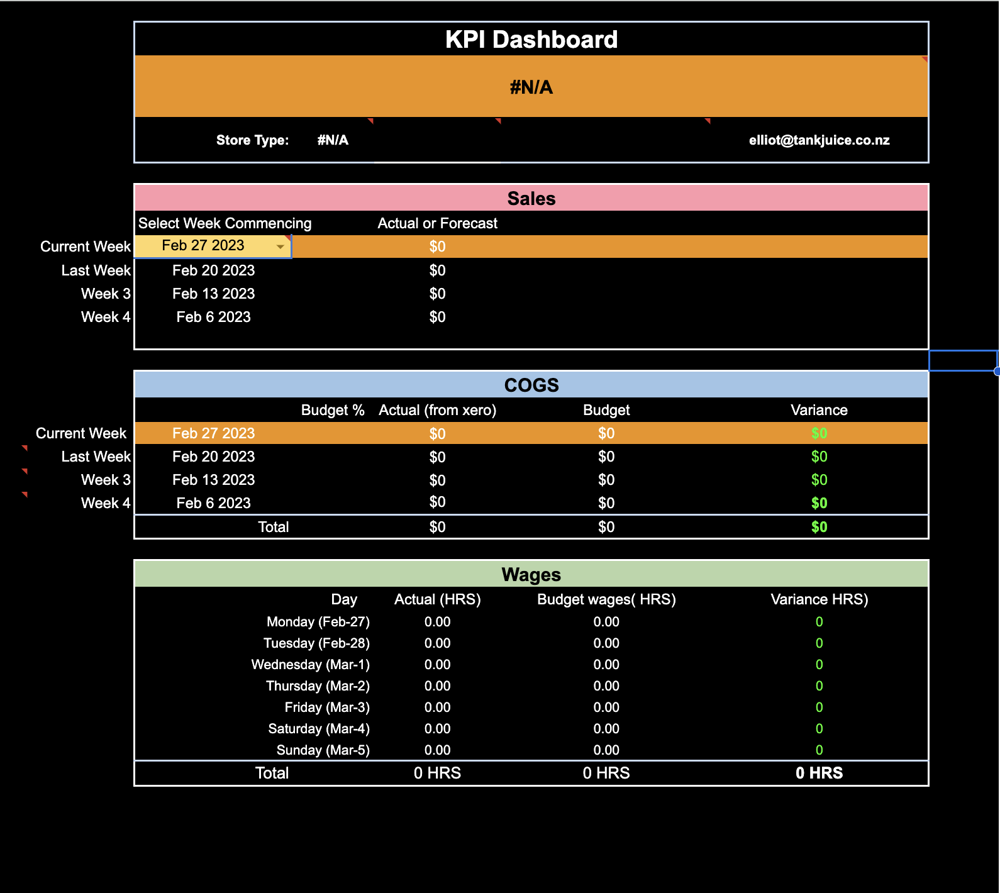
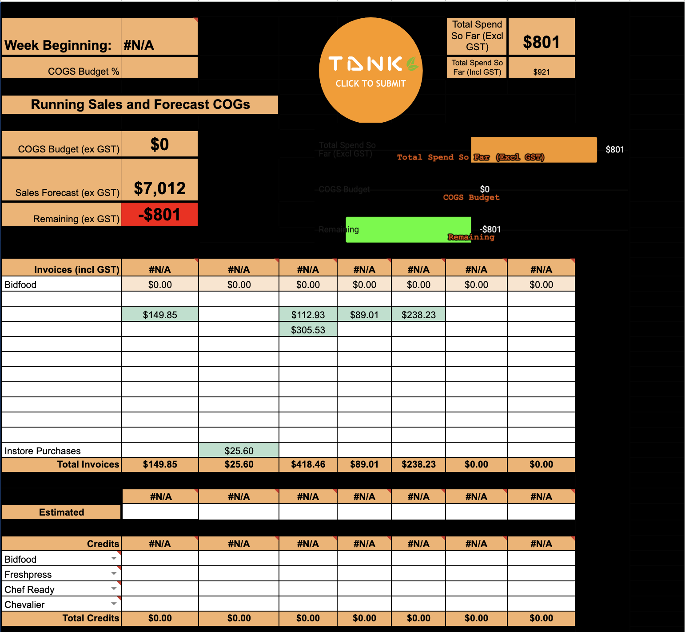

# Bens_Portfolio
Benjamin Obaje

# [Project 1: TankJuice Storemanagement](https://github.com/RonitMalik/Movie-Recommendation-System-)

The administration of the Tankjuice Store oversees and manages all business activities. Working with staff, making work plans, corresponding with suppliers, and handling consumer complaints are some of its primary tasks. Simple job delegation and priority setting for your team's top priorities. Organise your team's task, set project deadlines and milestones, and monitor progress all in one location. To construct an autonomous workflow system using holistics as a data warehouse and retain a LIVE dashboard and updates on their daily operations, they used Tableau, Excel, and Google.

* Data was taken from POS systems into the data warehouse 
* The model uses both; content-based filtering techniques and collaborative filtering techniques. 
* Coding Used : VBA, SQL and Google appscript and javascript.

## Overview Of TankkJuice SMT 
 
## Popular Movie Genres  

# [Project 2: Amazon Price Scrapper](https://github.com/RonitMalik/BlackFriday_pythonScrapper)

This was part of a personal project where a python price scrapper was built in order to track prices for specific items on amazon and then send out email alerts. 
The way the model works is you add a link to the amazon product and the price you're willing to buy the product at (Target Price) and then you can run the script and it will refresh the script every 24 hours and check the price for the product, as soon as the price of the product reaches your target price the scrapper will send you an email alert. 

I have also done an entire walkthrough video on youtube for the amazon price scapper and how you can build one too. [Click Here For Youtube Video](https://www.youtube.com/watch?v=vO668yAX3p8)

# [Project 3: Yahoo Finance Web Scrapping](https://github.com/RonitMalik/BlackFriday_pythonScrapper)

This project was part of my youtube channel where i build a yahoo finance web-scrapper to get stock prices from yahoo finance, I used the Yahoo_fin package to get the prices for various stock prices and ran further trend analysis. The main goal of this project was to explore the yahoo_fin package. 

The following video for this project can be found on my [Youtube Channel](https://www.youtube.com/watch?v=AsxpHMq2auc&t=656s)
